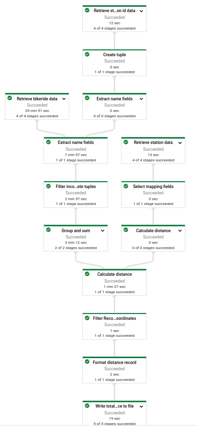

# Apache Beam pipeline to analyze London bicycle hiring dataset with GCP Dataflow

This repository contains an [Apache Beam](https://beam.apache.org/) pipeline that was used to analyze the [London bicycle hiring data set](https://console.cloud.google.com/marketplace/product/greater-london-authority/london-bicycles) using [Google Cloud Dataflow](https://cloud.google.com/dataflow). This dataset contains 83205227 bicycle hiring events in London. The pipeline will output the total number of bicycle hires for all combinations of bicycle stations, as well as the total distance covered by all those bicyle hire events.

The pipeline will source the full data set from [Google Bigquery](https://cloud.google.com/bigquery). Although the whole analysis could be performed directly using SQL queries, downstream analysis will be performed using the Aoache Beam pipeline. So all subsequent data transformations, such as cleaning the station IDs, counting the number of bike hires per station and calculating total distance covered between stations, are performed by the Apache Beam pipeline runnning on GCP Dataflow.

An overview of all pipeline processing steps as executed on GCP Dataflow can be seen in the pipeline [DAG](https://en.wikipedia.org/wiki/Directed_acyclic_graph) below.

**Note**: running this pipeline using GCP Dataflow will incur costs on your Google billing account, so use at your own responsibility!

  

